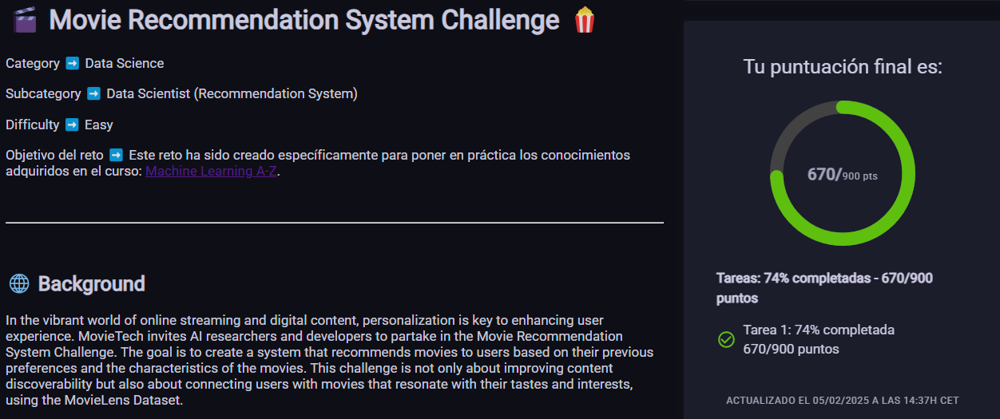

# 🎬 Movie Recommendation System Challenge 🍿

Category   ➡️   Data Science

Subcategory   ➡️   Data Scientist

Score   ➡️   74%



## 🌐 Background

In the vibrant world of online streaming and digital content, personalization is key to enhancing user experience. MovieTech invites AI researchers and developers to partake in the Movie Recommendation System Challenge. The goal is to create a system that recommends movies to users based on their previous preferences and the characteristics of the movies. This challenge is not only about improving content discoverability but also about connecting users with movies that resonate with their tastes and interests, using the MovieLens Dataset.


### 🗂️ Dataset

Participants will have access to the "MovieLens Dataset," which consists of:
name,user,rating,theme,production_year

- `rating`: Movie rating.
- `user`: User id.
- `name`, `theme`, `production_year`: Movie metadata title, genre and release year.

This dataset is fundamental for training your recommendation system to understand user preferences and predict movies they might enjoy.

This dataset will be used to create a model able to predict movies that the following users may enjoy:
- [Users to predict](https://cdn.nuwe.io/challenges-ds-datasets/frogames-mlaz2/users_test.csv)

### 📊 Data Processing

If you deem it necessary, apply some processing to the data such as encoding, scaling the variables or feature engineering to get new valuable insights.

### 🤖 Model

Select and train a predictive model or recommendation algorithm that suits the task. While the choice of model is open, consider using collaborative filtering, content-based filtering or hybrid methods. 

## 📂 Respository Structure

The repository structure is provided and must be adhered to strictly:

```
|__README.md
|__requirements.txt
|
|__data
|  |__movies_dataset.csv
|
|__src
|  |__data_processing.py
|  |__model_training.py 
|  |__model_prediction.py
|  |__utils.py
|
|__models
|  |__model.pkl
|
|__predictions
   |__example_predictions.json
   |__predictions.json

```

The `predictions` folder should contain the `predictions.json` file with your model's predicted insect categories.


## 🎯 Tasks:

Develop a recommendation system that effectively suggests movies to users based on their historical preferences and the features of the movies. The system should offer personalized recommendations that align with individual user tastes. For each user, propose the top 3 movies that the user may enjoy the most.


## 📤 Submission

Submit a predictions.json file containing your system's movie recommendations. Ensure the file is formatted correctly, with user IDs as keys and a list of recommended movie IDs as values.
```json
{
    "target": {
        "user1": [
            "Once Upon a Time in America",
            "The Lord of the Rings: The Two Towers",
            "The Truman Show"
        ],
        "user103": [
            "12 Angry Men",
            "Requiem for a Dream",
            "The Lion King"
        ],
        "user105": [
            "The Lion King",
            "The Shawshank Redemption",
            "Alien"
        ],
        ...
    }
}


```

## 📊 Evaluation

The effectiveness of your recommendation system will be measured based on how accurately it suggests movies that align with user preferences. K-precision metrics will be used to evaluate the relevance and accuracy of your recommendations, comparing the top 3 proposed movies with a list of relevant movies for each user.

**⚠️ Please note:**  
All submissions might undergo a manual code review process to ensure that the work has been conducted honestly and adheres to the highest standards of academic integrity. Any form of dishonesty or misconduct will be addressed seriously, and may lead to disqualification from the challenge.

Ensure that all data manipulation and model training strictly utilize the libraries mentioned in requirements.txt.


## ❓ FAQs

## Q1: What is the aim of the Movie Recommendation System Challenge?
A1: To develop a system that can accurately recommend movies to users based on their preferences and movie features.

## Q2: What type of data will I be working with?
A2: The dataset includes movie ratings, user information, and movie metadata.

## Q3: Are there any recommended models or algorithms?
A3: You're encouraged to explore collaborative filtering, content-based filtering, or hybrid approaches, ensuring you use the libraries from requirements.txt.

## Q4:  How will the system's effectiveness be evaluated?
A4: Effectiveness will be assessed using k-precision on the relevance and accuracy of the recommendations.